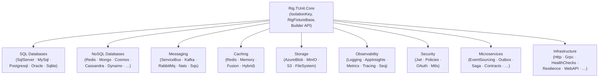

# Rig.TUnit

**A TUnit-first integration-testing rig ecosystem for .NET.**

[](https://github.com/Ecom-LTD/Rig.TUnit/actions/workflows/ci.yml)
[](https://www.nuget.org/packages/Rig.TUnit)
[](LICENSE)

---

## What is Rig.TUnit?

Rig.TUnit is a modular library of test helpers, fixtures, and assertion extensions built specifically
for the [TUnit](https://tunit.dev) test framework. It eliminates boilerplate from integration tests
by providing:

- **Container fixtures** — one-line Testcontainers setup for every major datastore and message broker.
- **Assertion extensions** — fluent assertions tailored to each provider (database tables, message
  ordering, blob existence, JWT claims, …).
- **A unified builder API** — `AddRigTUnit(rig => rig.UsePostgres(…))` wires fixtures into your
  DI-first test setup.
- **Per-test isolation** — every fixture derives an `IsolationKey` from the test execution context,
  guaranteeing zero cross-test state leakage even under full parallelism.

---

## Provider families

| Family | Packages |
|--------|---------|
| **SQL databases** | `SqlServer` · `MySql` · `Postgresql` · `Oracle` · `Sqlite` |
| **NoSQL databases** | `Redis` · `Mongo` · `Cosmos` · `Cassandra` · `Dynamo` · `ElasticSearch` · `KurrentDb` |
| **Messaging** | `ServiceBus` · `Kafka` · `RabbitMq` · `Nats` · `Sqs` |
| **Caching** | `Redis` · `Memory` · `Fusion` · `Hybrid` |
| **Storage** | `AzureBlob` · `FileSystem` · `MinIO` · `S3` |
| **Observability** | `Logging` · `AppInsights` · `Metrics` · `Tracing` · `Seq` |
| **Security** | `Jwt` · `Policies` · `OAuth` · `Mtls` |
| **Microservices** | `EventSourcing` · `Outbox` · `Inbox` · `Saga` · `Snapshots` · `Contracts` |
| **Infrastructure** | `Http` · `Grpc` · `HealthChecks` · `Resilience` · `Mediator` · `Docker` · `WebAPI` |

---

## Quick-start

Install the core package and at least one provider:

```bash
dotnet add package Rig.TUnit
dotnet add package Rig.TUnit.Databases.Sql.Postgresql
```

Wire the fixture into your test:

```csharp
public class OrderRepositoryTests
{
    [Test]
    public async Task CreateOrder_PersistsToDatabase(CancellationToken ct)
    {
        // Arrange — spin up a real Postgres container
        await using var db = new PostgresFixture();
        await db.InitializeAsync();

        // Act
        await using var conn = new NpgsqlConnection(db.ConnectionString);
        await conn.ExecuteAsync("INSERT INTO orders (id) VALUES (gen_random_uuid())");

        // Assert
        var count = await conn.ExecuteScalarAsync<int>("SELECT COUNT(*) FROM orders");
        await Assert.That(count).IsEqualTo(1);
    }
}
```

Or compose multiple providers using the builder API:

```csharp
services.AddRigTUnit(rig =>
    rig.UsePostgres(RigConnect.FromValue(cs), pg =>
        pg.ReplaceDbContext<AppDbContext>())
       .UseServiceBus(RigConnect.FromValue(sbCs), sb => { }));
```

---

## Builder API

The builder is the primary composition point. Register it during `IServiceCollection` setup:

```csharp
services.AddRigTUnit(rig =>
{
    rig.UsePostgres(RigConnect.FromValue(connectionString), pg =>
        pg.ReplaceDbContext<OrderDbContext>());

    rig.UseGrpc(factory, grpc =>
        grpc.ReplaceClient<OrderService.OrderServiceClient>());

    rig.UseServiceBus(RigConnect.FromValue(sbCs), _ => { });
});
```

`RigConnect` has two source modes:

| Source | When to use |
|--------|-------------|
| `RigConnect.FromValue(cs)` | Hard-coded connection string (unit / integration tests) |
| `RigConnect.FromConfig(configuration, "ConnectionStrings:Db")` | Reads from `IConfiguration` (config-driven environments) |

---

## Isolation

Every fixture automatically derives an `IsolationKey` from TUnit's execution context:

```csharp
// Two fixtures running in parallel get distinct keys
var a = IsolationKey.FromExecutionContext();  // e.g. "OrderTests.CreateOrder-abc12"
var b = IsolationKey.FromExecutionContext();  // e.g. "OrderTests.ReadOrder-def34"
```

Each provider uses the isolation key to namespace its resources — table names, topic names,
bucket prefixes, cache key prefixes — so 50 parallel tests never touch each other's data.

You can also pin a key explicitly for shared-fixture scenarios:

```csharp
var key = IsolationKey.FromName("shared-read-model");
```

---

## Provider catalogue

| Package | NuGet ID | Fixtures | Assertions |
|---------|----------|----------|------------|
| Core | `Rig.TUnit.Core` | `RigFixtureBase` | — |
| PostgreSQL | `Rig.TUnit.Databases.Sql.Postgresql` | `PostgresFixture` | `DatabaseAssert` |
| SQL Server | `Rig.TUnit.Databases.Sql.SqlServer` | `SqlServerFixture` | `DatabaseAssert` |
| MySQL | `Rig.TUnit.Databases.Sql.MySql` | `MySqlFixture` | `DatabaseAssert` |
| Oracle | `Rig.TUnit.Databases.Sql.Oracle` | `OracleFixture` | `DatabaseAssert` |
| SQLite | `Rig.TUnit.Databases.Sql.Sqlite` | `SqliteFixture` | `DatabaseAssert` |
| Redis (KV) | `Rig.TUnit.Databases.NoSql.Redis` | `RedisKvFixture` | `KeyScanHelper` |
| MongoDB | `Rig.TUnit.Databases.NoSql.Mongo` | `MongoFixture` | `JsonDocumentAssert` |
| Cosmos DB | `Rig.TUnit.Databases.NoSql.Cosmos` | `CosmosFixture` | `ChangeFeedCapture` |
| Cassandra | `Rig.TUnit.Databases.NoSql.Cassandra` | `CassandraFixture` | — |
| DynamoDB | `Rig.TUnit.Databases.NoSql.Dynamo` | `DynamoFixture` | — |
| Elasticsearch | `Rig.TUnit.Databases.NoSql.ElasticSearch` | `ElasticSearchFixture` | — |
| KurrentDB | `Rig.TUnit.Databases.NoSql.KurrentDb` | `KurrentDbFixture` | — |
| Azure Service Bus | `Rig.TUnit.Messaging.ServiceBus` | `ServiceBusFixture` | `MessageAssert`, `OrderingAssert` |
| Apache Kafka | `Rig.TUnit.Messaging.Kafka` | `KafkaFixture` | `MessageAssert` |
| RabbitMQ | `Rig.TUnit.Messaging.RabbitMq` | `RabbitMqFixture` | `MessageAssert` |
| NATS | `Rig.TUnit.Messaging.Nats` | `NatsFixture` | `MessageAssert` |
| Amazon SQS | `Rig.TUnit.Messaging.Sqs` | `SqsFixture` | `MessageAssert` |
| Redis Cache | `Rig.TUnit.Caching.Redis` | `RedisCacheFixture` | — |
| Memory Cache | `Rig.TUnit.Caching.Memory` | `MemoryCacheFixture` | `CacheAssert` |
| FusionCache | `Rig.TUnit.Caching.Fusion` | `FusionCacheFixture` | `StampedeTester` |
| HybridCache | `Rig.TUnit.Caching.Hybrid` | — | — |
| Azure Blob | `Rig.TUnit.Storage.AzureBlob` | `AzureBlobFixture` | `BlobAssert` |
| MinIO | `Rig.TUnit.Storage.MinIO` | `MinIOFixture` | `BlobAssert` |
| Amazon S3 | `Rig.TUnit.Storage.S3` | `S3Fixture` | `BlobAssert` |
| File System | `Rig.TUnit.Storage.FileSystem` | — | — |
| gRPC | `Rig.TUnit.Grpc` | `GrpcClientHelper<TClient>` | — |
| HTTP | `Rig.TUnit.Http` | `HttpMockVerifier` | `CapturedRequest` |
| Health Checks | `Rig.TUnit.HealthChecks` | — | `HealthAssert` |
| Resilience | `Rig.TUnit.Resilience` | — | `BulkheadAssert` |
| MediatR | `Rig.TUnit.Mediator` | — | — |
| Event Sourcing | `Rig.TUnit.Microservices.EventSourcing` | — | `AggregateAssert` |
| Outbox | `Rig.TUnit.Microservices.Outbox` | — | `OutboxEntryAssertion` |
| Saga | `Rig.TUnit.Microservices.Saga` | `SagaHarness` | `SagaAssert` |
| Seq | `Rig.TUnit.Observability.Seq` | `SeqFixture` | `SeqAssert` |
| App Insights | `Rig.TUnit.Observability.AppInsights` | — | `AppInsightsDependencyAssertion` |
| JWT | `Rig.TUnit.Security.Jwt` | `JwtFixture` | — |
| Auth Policies | `Rig.TUnit.Security.Policies` | `PolicyFixture` | `PolicyAssert` |
| WebAPI | `Rig.TUnit.WebAPI` | `WebApiFactory<TProgram>` | — |

---

## Running tests

> **TUnit uses [Microsoft.Testing.Platform](https://learn.microsoft.com/dotnet/core/testing/microsoft-testing-platform-intro)**
> (MTP). Unlike xUnit/NUnit, `--filter "Category!=Integration"` and
> `dotnet run` do **not** work. Tests must be run project-by-project with
> `dotnet test`, and MTP-specific flags are passed after `--`.

Run a single unit-test project:

```bash
dotnet test tests/Rig.TUnit.Core.Tests.Unit -c Release
```

Run all unit tests (bash — Linux/macOS):

```bash
find tests -name "*.csproj" \
  | grep -Ev "Integration|Benchmarks|Contract" \
  | xargs -I{} dotnet test {} -c Release
```

Run all unit tests (PowerShell — Windows):

```powershell
Get-ChildItem tests -Recurse -Filter "*.csproj" |
  Where-Object { $_.Name -notmatch "Integration|Benchmarks|Contract" } |
  ForEach-Object { dotnet test $_.FullName -c Release }
```

Run integration tests (requires Docker):

```bash
dotnet test tests/Rig.TUnit.Messaging.ServiceBus.Tests.Integration -c Release
```

Filter by test name (TUnit MTP syntax — pass flags after `--`):

```bash
dotnet test tests/Rig.TUnit.Core.Tests.Unit -- --filter "IsolationKey"
```

### Development setup

After cloning, install the commit-message hook:

```bash
git config core.hooksPath .githooks
```

---

## Benchmarks

Allocation and throughput benchmarks live in `tests/Rig.TUnit.Benchmarks/`.
They use [BenchmarkDotNet](https://benchmarkdotnet.org/) with an in-process, single-iteration
(`Job.Dry`) configuration to keep CI fast.

Run benchmarks locally:

```bash
dotnet run -c Release --project tests/Rig.TUnit.Benchmarks -- \
  --filter "*" --exporters json --artifacts ./benchmark-results
```

Historical baselines are stored in `benchmarks/baseline-NNN.json`. CI compares each PR
run against the current baseline and blocks on regressions exceeding 20%.

---

## CI pipeline

The GitHub Actions workflow (`.github/workflows/ci.yml`) enforces:

| Job | What it checks |
|-----|----------------|
| `build` | Solution builds on .NET 10 |
| `unit-tests` | All `*.Tests.Unit` projects pass |
| `integration-core` | Core, CI, Grpc, Http, WebAPI, Mediator and more pass against live containers |
| `benchmark-regression` | BDN smoke run; blocks on non-zero exit (no `|| true` guards) |
| `coverage-gate` | Every package ≥ 90% line coverage |
| `red-commit-verification` | Every `red(T###):` commit fails at its SHA |
| `commit-msg-lint` | All commits follow Conventional Commits |

---

## TDD discipline

Rig.TUnit is developed with a strict red-green cycle enforced by tooling:

1. **Write a failing test** — commit with `test(NNN): T<n> — RED`
2. **Make it pass** — commit with `green(T<n>): <description>`
3. **CI verifies the red commit fails** at its original SHA

The `.githooks/commit-msg` hook enforces valid prefixes on every commit:
`test:`, `feat:`, `refactor:`, `fix:`, `chore:`, `docs:`, `style:`, `perf:`,
`build:`, `ci:`, `revert:` — plus the TDD-specific `green(T###):` and `red(T###):` forms.

---

## Contributing

1. Fork the repository and create a feature branch: `feat/NNN-short-name`
2. Follow the TDD red-green cycle (see above)
3. Ensure unit tests pass (`dotnet test {YourProject} -c Release`) and coverage stays ≥ 90%
4. Open a pull request — CI will run the full suite automatically

For significant changes, open an issue first to discuss the approach.

---

## Architecture



All provider packages take `Rig.TUnit.Core` as their only required dependency. Providers are
self-contained; consuming a SQL provider does not pull in messaging packages.

---

## License

MIT — see [LICENSE](LICENSE).
