# Rig.TUnit Architecture

Visual + textual overview of how `Rig.TUnit.*` packages compose. Leaf-provider
READMEs link back here from §13 (Related docs).

## Family graph

```mermaid
graph TD
  Core[Rig.TUnit.Core<br/>RigBuilder · RigConnect · IsolationKey]
  All[Rig.TUnit.All<br/>umbrella]

  Core --> Mediator[Rig.TUnit.Mediator]
  Core --> Grpc[Rig.TUnit.Grpc]
  Core --> WebAPI[Rig.TUnit.WebAPI]
  Core --> Http[Rig.TUnit.Http]
  Core --> Docker[Rig.TUnit.Docker]

  Core --> DbBase[Rig.TUnit.Databases]
  DbBase --> Sql[Rig.TUnit.Databases.Sql]
  DbBase --> NoSql[Rig.TUnit.Databases.NoSql]

  Sql --> SqlServer[.SqlServer]
  Sql --> Postgres[.Postgresql]
  Sql --> MySql[.MySql]
  Sql --> Oracle[.Oracle]
  Sql --> Sqlite[.Sqlite]

  NoSql --> Mongo[.Mongo]
  NoSql --> Cosmos[.Cosmos]
  NoSql --> Cassandra[.Cassandra]
  NoSql --> Dynamo[.Dynamo]
  NoSql --> Elastic[.ElasticSearch]
  NoSql --> Kurrent[.KurrentDb]
  NoSql --> RedisKv[.Redis]

  Core --> Messaging[Rig.TUnit.Messaging]
  Messaging --> Kafka[.Kafka]
  Messaging --> Nats[.Nats]
  Messaging --> Rabbit[.RabbitMq]
  Messaging --> SB[.ServiceBus]
  Messaging --> Sqs[.Sqs]

  Core --> Caching[Rig.TUnit.Caching]
  Caching --> Memory[.Memory]
  Caching --> RedisCache[.Redis]
  Caching --> Hybrid[.Hybrid]
  Caching --> Fusion[.Fusion]

  Core --> Storage[Rig.TUnit.Storage]
  Storage --> AzureBlob[.AzureBlob]
  Storage --> S3[.S3]
  Storage --> MinIO[.MinIO]
  Storage --> FileSystem[.FileSystem]

  Core --> Security[Rig.TUnit.Security]
  Security --> Jwt[.Jwt]
  Security --> OAuth[.OAuth]
  Security --> Mtls[.Mtls]
  Security --> Policies[.Policies]

  Core --> Obs[Rig.TUnit.Observability]
  Obs --> Logging[.Logging]
  Obs --> LoggingAn[.Logging.Analyzers]
  Obs --> Metrics[.Metrics]
  Obs --> Seq[.Seq]
  Obs --> Tracing[.Tracing]
  Obs --> AppI[.AppInsights]

  Core --> Micro[Rig.TUnit.Microservices]
  Micro --> Contracts[.Contracts]
  Micro --> Saga[.Saga]
  Micro --> Inbox[.Inbox]
  Micro --> Outbox[.Outbox]
  Micro --> Snapshots[.Snapshots]
  Micro --> ES[.EventSourcing]

  Core --> Util1[Rig.TUnit.Ci]
  Core --> Util2[Rig.TUnit.Concurrency]
  Core --> Util3[Rig.TUnit.HealthChecks]
  Core --> Util4[Rig.TUnit.Parallelism]
  Core --> Util5[Rig.TUnit.Resilience]

  All -.transitive.-> Core
  All -.transitive.-> DbBase
  All -.transitive.-> Messaging
  All -.transitive.-> Caching
  All -.transitive.-> Storage
  All -.transitive.-> Security
  All -.transitive.-> Obs
  All -.transitive.-> Micro
```

## Layering rules

1. **`Rig.TUnit.Core`** — foundation. Depends on nothing except `TUnit.Core` +
   `Microsoft.Extensions.*` abstractions. Every other package ultimately references it.
2. **Family-base packages** (`Rig.TUnit.Databases`, `Rig.TUnit.Databases.Sql`,
   `Rig.TUnit.Messaging`, etc.) — shared contracts (`IDbRig`, `ISqlRig`, etc.), base
   fixtures, and family-level assertions.
3. **Leaf-provider packages** — one per concrete backing technology. Ship the canonical
   quartet: `{Provider}Fixture`, `{Provider}FixtureOptions`, `{Provider}RigBuilder`,
   `Use{Provider}` extension.
4. **`Rig.TUnit.All`** — umbrella NuGet pulling in every leaf. Consumers who don't know
   which providers they need can take this single dependency.

Dependency direction flows **only inward** — a leaf never depends on another leaf.
Cross-provider coordination goes through `Rig.TUnit.Core`'s `RigBuilder`.

## Provider consistency (post-004)

Every leaf provider ships the canonical quartet — enforced by
[`ProviderCompletenessTests`](../tests/Rig.TUnit.Architecture.Tests/Rules/ProviderCompletenessTests.cs).
32 providers pass today; 4 are by-design exemptions (in-process cache + telemetry-style
observability packages).

## See also

- [CHANGELOG.md](../CHANGELOG.md) — version history + breaking renames
- [docs/glossary.md](glossary.md) — terminology
- [docs/adr/](adr/) — design decisions
